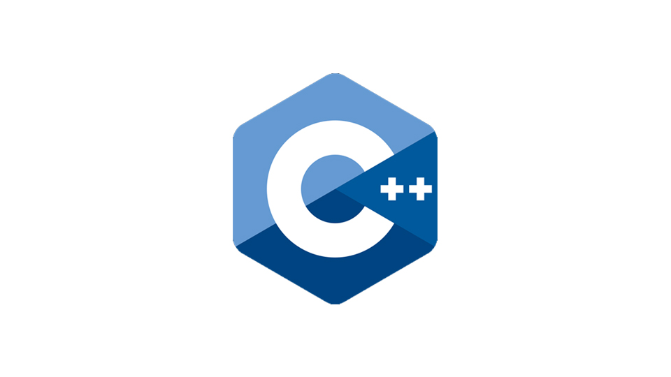
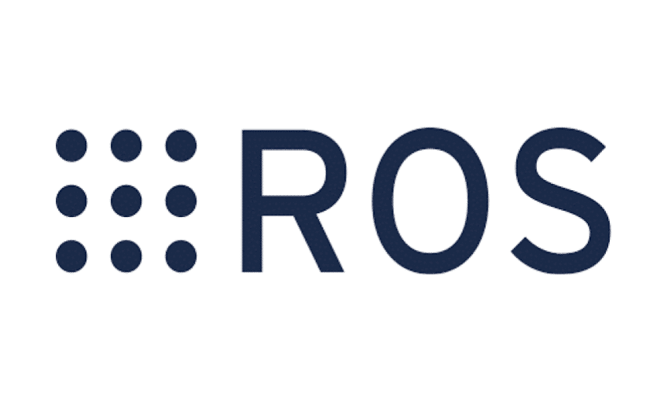
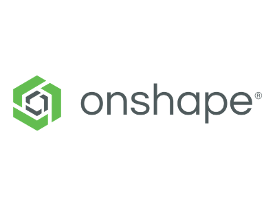
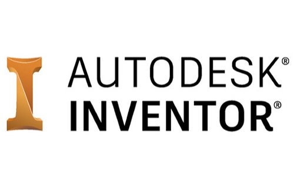

# Skills and habilities

## Programming languages
### C++

[Exemple 1](https://github.com/tiago369/Desafios-de-preparacao-rasc)

### Python

[Exemple 1](https://github.com/tiago369/Desafios-de-preparacao-rasc)

## OpenCv

[Exemple 1](https://github.com/tiago369/Desafios-de-preparacao-rasc)
[Exemple 2](https://ieeecimatec.github.io/project-mao_espelhada/)

## ROS

[Exemple 1](https://github.com/tiago369/Desafios-de-preparacao-rasc)

[Exemple 2](https://github.com/tiago369/dobot-ros)

## 3D modeling/CAD
### Onshape

[Example 1](https://cad.onshape.com/documents/6248e75573a361b0fc9d796e/w/6c5744214ee6ded61df2d5aa/e/6296b6cb4a8a85d00fd805e2)

[Example 2](https://ieeecimatec.github.io/project-mao_espelhada/)

### Autodesk Inventor

## People managment

## Others

  